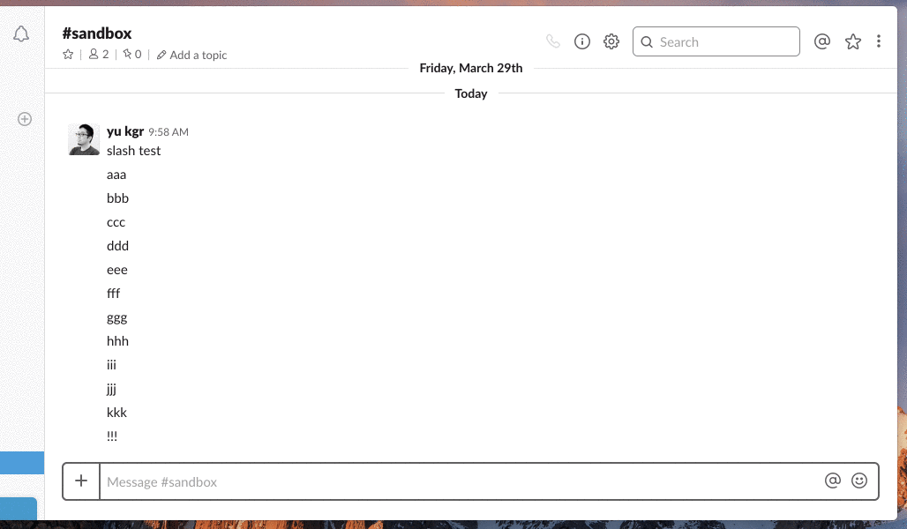

Slash - Alfred workflow.

===

Overview

## Description

- In the case of Slack Enterprise Grid, it is necessary to "/dnd {time}" in all Workspaces, so I made it troublesome.
- "/slash {query}" workflow use alfred. after forced termination of Slack.app, restart at specific time.

## Demo

## Usage

`slash {INT}s | {INT}m | {INT}h`

## Install

1. [Download](https://raw.github.com/yu-kgr/alfred-slash-workflow/master/Slash.alfredworkflow) Slash Workflow.
2. Double-click to import into Alfred
3. Review the workflow to add custom Hotkeys

## Licence

[MIT](https://github.com/tcnksm/tool/blob/master/LICENCE)

## Author

[yu-kgr](https://github.com/yu-kgr)
